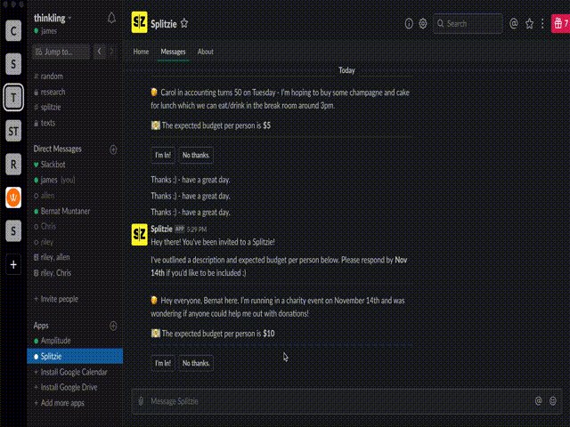

Welcome to SPLITZIE!

Splitzie is a JavaScript based Slackbot service which helps organize and track personal expenses across Slack. This is the main code required to run the Slackbot.

<object data="./splitzie_presentation.pdf" type="application/pdf" width="700px" height="700px">
    <embed src="./splitzie_presentation.pdf">
        
Checkout the overview deck <a href="./splitzie_presentation.pdf">here</a>.

    </embed>
</object>

Create Flow:

Accept Flow:

Remind Flow:

